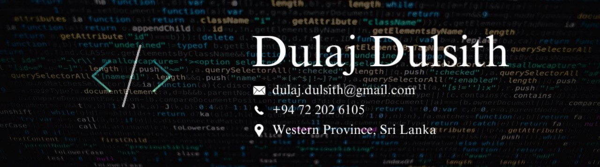

# Dulaj Dulsith

Here is my Portfolio Website: https://my-portfolio-sigma-ivory-60.vercel.app/

I'm a passionate and goal-oriented developer currently pursuing **a Bachelor’s Degree in Computing under Plymouth University, UK as a 2nd year student**. I have successfully completed my GCE  (A/L) and (O/L) examinations, as well as **Diplomas in ICT (DiTEC) and English (DIE) from Esoft Metro Campus**. I enjoy solving real-world problems using technologies like:

- 💻 Web Development: HTML, CSS, JavaScript, PHP, MySQL, Bootstrap, Node.js, Express.js, Socket.io
- 💬 Real-Time Features: Implemented live public chatrooms with real-time updates using PHP and MySQL
- 💳 Payment Systems: Integrated secure Stripe and PayPal payment gateways for web transactions
- 🌐 Frameworks & Tools: ASP.NET, XAMPP, VS Code, Android Studio
- 🔌 IoT Projects: Arduino-based smart plantation systems
- 🚀 Version Controlling: Git knowledge with completing some carreer essentials in GitHub.

Still learning and trying to improve all these sides for a professional carrier. I’m passionate about sustainability, tech for good, and enabling better user experiences through clean design and functional code.
