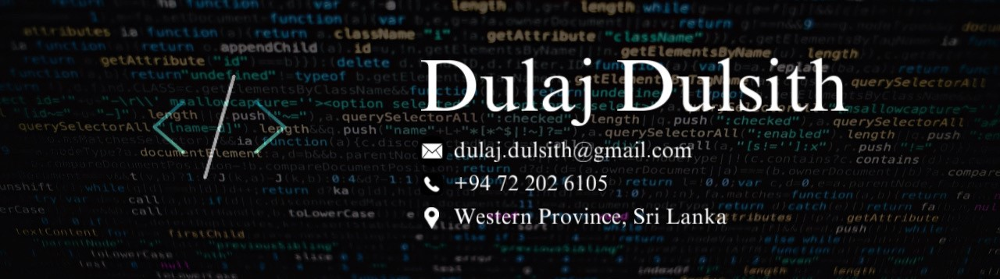

<!-- Banner -->

  

🌐 **Hii, Here is My Portfolio Website:**  
👉 https://my-portfolio-sigma-ivory-60.vercel.app/

I'm a **passionate and goal-oriented developer** currently pursuing a 🎓 **Bachelor’s Degree in Computing (Last Year)** under **Plymouth University, UK**. I have successfully completed:
- 📘 GCE (O/L) and (A/L) 
- 🗣️ **Diploma in ICT (DiTEC)** – Esoft Metro Campus
- 🗣️ **Diploma in English (DIE)** – Esoft Metro Campus
- 🎓 **BSc (hons) in Software Engineering** - NSBM Green University *

I enjoy building **real-world applications**, learning modern technologies, and continuously improving my skills for a **professional career**.

### 🚀 Tech Stack

---

### 🌱 Currently Learning

- Advanced MERN / PERN Stack... etc
- DevOps / CI/CD workflows
- System design & scalable backend architecture
- Clean UI/UX patterns

---

### 📫 Contact

- 💼 GitHub: **Dulaj Dulsith**
- 📧 Email: *dulaj.dulsith@gmail.com*
- 📞 Contact or WhatsApp: *+94 72 202 6105*  
- 🤝 Open to internships, freelance work & collaborations

---

### ⚡ Fun Fact

Still learning, still building, still improving 🚀  
Consistency beats motivation.

---

  ⭐ If you like my work, consider giving a star!

